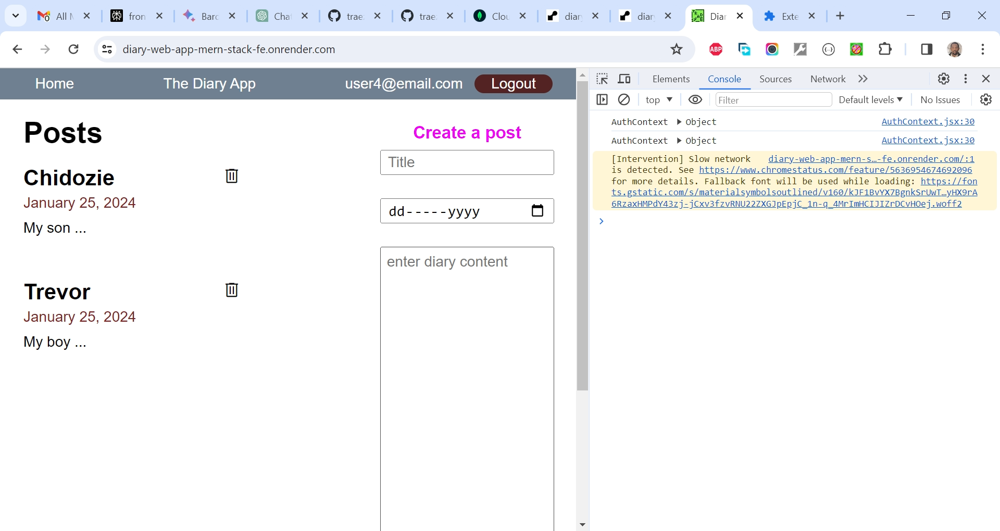

# Umar Khan's Build a Diary Web App using the MERN Stack Project

This is a solution to the [Umar Khan's Build a Diary Web App using the MERN Stack Project](https://www.youtube.com/watch?v=rl7AVEi5hls). I'm testing my hand creating very simple (follow along) projects for now to get familiar with the matter. 

## Table of contents

- [Overview](#overview)
  - [The challenge](#the-challenge)
  - [Screenshot](#screenshot)
  - [Links](#links)
  - [My process](#my-process)
  - [Built with](#built-with)
  - [What I learned](#what-i-learned)
  - [Continued development](#continued-development)
  - [Useful resources](#useful-resources)
  - [Author](#author)
  - [Acknowledgments](#acknowledgments)

## Overview

### The Challenge/User Stories

Build a full stack web application and deploy it to Render, a hosting service. This means your application can be used from anywhere with an internet connection!

Our tech stack for this project will consist of MongoDB for the database, Express.js as the web server framework, React on the frontend, and Node.js as the server environment (MERN).

We'll be using Visual Studio Code, MongoDB Compass, and Postman to help us build the application. And we'll learn how to set up a backend API including routes, controllers, and middleware, as well as a frontend, where we will get practice creating custom hooks, global state using the React Context API, and much more. 

### Screenshot

### Links

- Solution URL: [https://github.com/traez/mern-stack-diary-web-app](https://github.com/traez/mern-stack-diary-web-app)
- Live Site URL: [https://mern-stack-diary-web-app.onrender.com/](https://mern-stack-diary-web-app.onrender.com/)

## My process

### Built with

- Semantic HTML5 markup 
- CSS custom properties 
- Flexbox 
- CSS Grid 
- Mobile-first workflow 
- [React](https://reactjs.org/) - JS library 
- [Next.js](https://nextjs.org/) - React framework (No)
- Tailwind CSS  
- Typescript (No)
- Nodejs
- Expressjs
- MongoDB

### What I learned

- The existence and use of MongoDB Compass  
- That Git still creates branch as master by default, hence Githubs "git branch -m master main" rename command  
- In future MERN projects i should consider using a .env file for fetch url in the frontend. So I can change more sensibly from a single source.   
- Frontend and Backend both deployed on render here. Not bad. (Vercel was spared for frontend. Note that with Next.js server actions, both frontend and backend go on Vercel. Next.js framework being a substitute for Expressjs framework).  

### Continued development

- More increasingly complex MERN stack projects. 

### Useful resources

Stackoverflow  
YouTube  
Google  
ChatGPT

## Author

- Website - [Trae Zeeofor](https://github.com/traez)
- Twitter - [@trae_z](https://twitter.com/trae_z)

## Acknowledgments

To all MERN stack Developers and Content Creators. Well done!.
